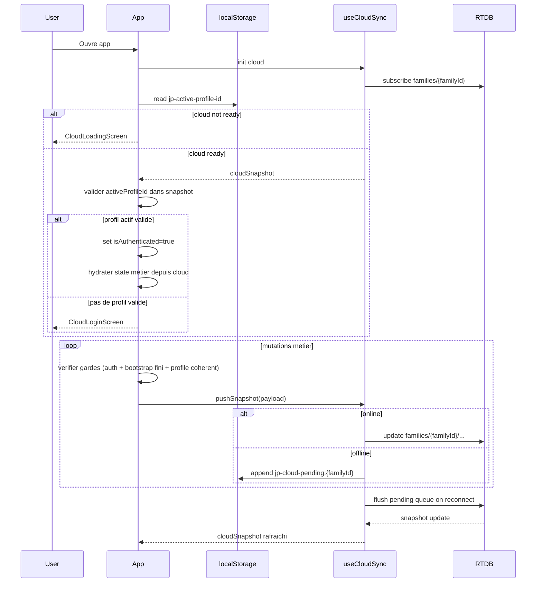

# ADR 11.3 - Source of Truth Cloud/Local

Date: 2026-07-15
Statut: propose (pre-implementation)
Story cible: 11.3 - Source de verite cloud pour state partage

## 1) ADR source of truth cloud/local

### Decision

Le cloud (RTDB sous families/{familyId}) devient la source de verite unique pour les donnees metier partagees et profile-scopes.

Le localStorage est limite a:
- session device (profil actif memorise)
- file technique offline/retry
- caches temporaires de demarrage seulement si cloud indisponible

### Rationale

- Eviter les divergences inter-navigateurs (Chrome vs Edge) sur un meme familyId.
- Reduire les conflits de state entre bootstrap local et snapshot cloud.
- Mieux maitriser les transitions de session (switch profil, relogin, refresh).

### Consequences

- Les writes metier passent par push cloud sous garde stricte d auth.
- Les lectures metier sont hydratees depuis cloudSnapshot lorsque cloud est actif.
- Les cles localStorage metier historiques sont depreciees/migrees.

## 2) Matrice ownership des etats

| Etat | Ownership | Scope | Lecture primaire | Ecriture primaire | Local fallback |
|---|---|---|---|---|---|
| familyState (ownerProfileId, roles) | Cloud | Famille | cloudSnapshot.familyState | pushSnapshot | cache lecture uniquement |
| ownerCodeHash | Cloud | Famille | cloudSnapshot.ownerCodeHash | pushSnapshot | migration legacy hash |
| phase | Cloud | Profil aujourd hui, famille-wide apres 11.6 | cloudSnapshot.profiles[profileId].phase (puis families/{familyId}/phase) | pushSnapshot | cache non autoritaire |
| checklist | Cloud | Profil | cloudSnapshot.profiles[profileId].checklist | pushSnapshot | cache non autoritaire |
| gameHistory | Cloud | Profil | cloudSnapshot.profiles[profileId].gameResults | pushSnapshot | cache non autoritaire |
| profil actif (activeProfileId) | Local | Device session | localStorage jp-active-profile-id + cloud validation | localStorage | oui |
| queue offline (jp-cloud-pending:{familyId}) | Local technique | Device/familyId | localStorage | localStorage + flush | oui |
| unlockFailedAttempts / unlockLockedUntil | Local (court terme) | Device | localStorage | localStorage | oui |
| screen UI courant | Local runtime | Device runtime | state React | state React | n/a |

Note: la migration 11.6 fera passer phase en famille-wide (families/{familyId}/phase) pour aligner la decision produit.

## 3) Sequence startup/sync

## 4) Plan de migration en 2 etapes

### Etape 1 - Soft migration (compatible clients existants)

- Garder les cles locales existantes en lecture de compatibilite, mais les traiter comme cache non autoritaire.
- A la reception d un cloudSnapshot valide:
  - ecraser le state metier runtime avec cloud
  - eviter de re-pousser immediatement des valeurs locales stale (dedup par payload)
- Limiter les ecritures locales metier au strict minimum (telemetrie/dev + backup transitoire si besoin).

Critere de sortie etape 1:
- Coherence verifiee sur 2 navigateurs et 2 appareils pour un meme familyId.

### Etape 2 - Hardening + deprecation

- Supprimer progressivement l usage autoritaire des cles metier locales:
  - jp-family-state
  - jp-owner-code-hash (cache optional)
  - jp-phase
  - jp-checklist
  - jp-game-history
- Conserver:
  - jp-active-profile-id
  - jp-cloud-pending:{familyId}
  - unlockFailedAttempts / unlockLockedUntil (jusqu a decision explicite de centralisation)
- Ajouter guardrails explicites: aucun push cloud si auth/session non stabilisee.

Critere de sortie etape 2:
- Plus aucun comportement metier ne depend d une valeur locale en desaccord avec le cloud.

## 5) Checklist de tests d acceptation architecture

### A. Cold start & bootstrap
- [ ] Cloud actif, snapshot lent: loading affiche, pas d ecran metier premature.
- [ ] activeProfileId absent: login affiche sans crash.
- [ ] activeProfileId invalide (profil supprime): login affiche, state nettoye.

### B. Coherence multi-navigateurs
- [ ] Mutation checklist sur navigateur A visible sur navigateur B.
- [ ] Changement surname/role owner sanitize visible partout.
- [ ] Refresh en phase during: rendu valide, pas de null.

### C. Isolation de profil
- [ ] Switch A->B: aucun item checklist A dans B.
- [ ] Aucun push cloud tant que B n est pas authentifie.
- [ ] Reconnexion profil A retrouve ses donnees propres.

### D. Offline/retry
- [ ] Hors-ligne: mutations queuees localement.
- [ ] Reconnexion: flush queue puis convergence snapshot.
- [ ] En cas echec de push, mutation conservee en queue sans corruption.

### E. Securite et observabilite
- [ ] Logs dev visibles pour push skip (auth/bootstrap non valide).
- [ ] Logs dev visibles pour fallback navigation inconnu.
- [ ] Audit rules (11.5) bloque write/read non autorise en environnement test.

## Notes de mise en oeuvre immediate (11.3)

- Reutiliser les gardes deja en place de 11.2/11.4.
- Introduire un mode "cloud-authoritative" explicite dans l hydratation App.
- Eviter toute reintroduction de logique autoritaire locale dans de nouvelles stories 9/10.
