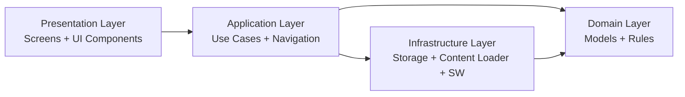
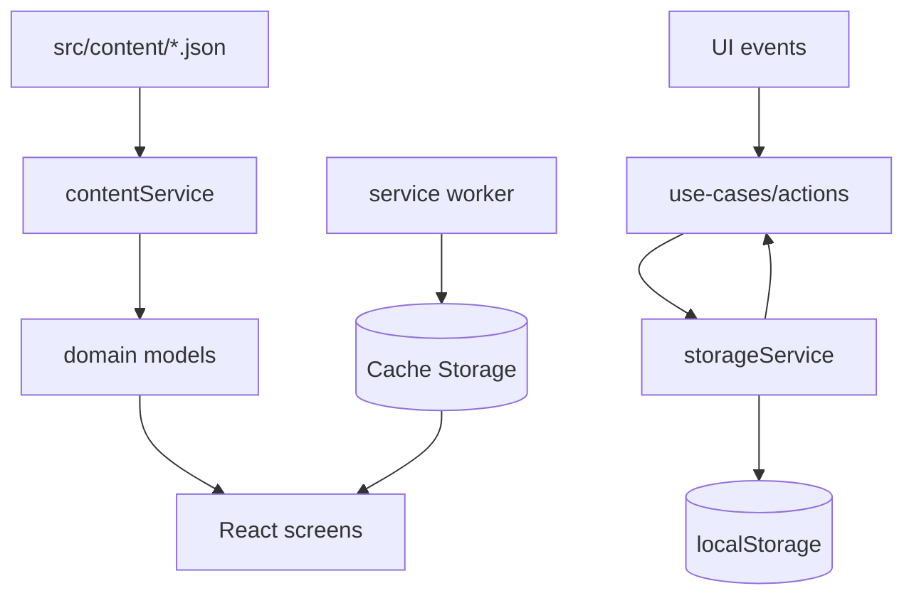

# Architecture Spine - Application voyage familiale 2026

## Design Paradigm

Pattern retenu: architecture en couches frontend avec modele domaine local.

- Couche Presentation: composants React ecran + composants UI
- Couche Application: orchestration des use-cases et navigation d ecrans
- Couche Domain: modeles metier (Profil, Phase, Lieu, Quiz, Resultat)
- Couche Infrastructure: persistance locale, chargement contenu, service worker offline

Mappage dossier cible:
- src/app/screens pour les ecrans
- src/domain pour types + regles metier
- src/services pour storage/content/offline adapters
- src/content pour donnees Turquie versionnees

## Invariants & Rules

### AD-1 - Separation stricte UI et contenu

- Binds: FR-7, FR-9, FR-10, FR-12, FR-14, FR-15
- Prevents: hardcoding de textes/medias dans les composants
- Rule: tout contenu metier (lieux, conseils, quiz, labels voyage) est charge depuis src/content et jamais defini inline dans les ecrans.

### AD-2 - Persistance locale centralisee

- Binds: FR-1, FR-2, FR-4, FR-5, FR-6, FR-13
- Prevents: acces direct localStorage disperse dans des composants multiples
- Rule: une seule API storage (storageService) gere lecture/ecriture de Profil, Phase, Checklist, Resultats.

### AD-3 - Controle d acces par role et phase

- Binds: FR-3, FR-4, FR-8
- Prevents: deblocage bypass et affichage de modules non autorises
- Rule: toute transition vers Phase Pendant Voyage passe par unlockUseCase (verification Code Proprietaire) et les routes ecran appliquent guard role/phase.

### AD-4 - Evolution incrementale des stories

- Binds: all
- Prevents: stories dependantes de travail futur non livre
- Rule: chaque story doit etre livrable independamment avec fallback explicite quand une donnee/feature amont est absente.

### AD-5 - Offline MVP par cache shell + contenu recemment consulte

- Binds: FR-16
- Prevents: promesse offline totale non tenue
- Rule: le service worker cache au minimum app shell + assets critiques + dernier snapshot de contenu consulte; l UI indique clairement etat hors ligne.

### AD-6 - Erreurs utilisateur non bloquantes

- Binds: FR-4, FR-10, FR-11, FR-15, FR-16
- Prevents: crash ecran sur donnees invalides, media absent, reseau coupe
- Rule: toute erreur de chargement/lecture est transformee en message UI comprehensible + fallback visuel.

### AD-7 - Source de verite des types domaine

- Binds: FR-1 a FR-16
- Prevents: divergence entre shape des donnees et usages composant
- Rule: les interfaces TypeScript domaine sont definies une seule fois dans src/domain/models.ts et reutilisees partout.

### AD-8 - Navigation ecran pilotee par etat app

- Binds: FR-4, FR-8
- Prevents: navigation implicite difficile a tester
- Rule: la navigation principale est derivee de appState (phase + screen courant + contexte) et manipulee via actions explicites.

## Dependency Direction



## Consistency Conventions

| Concern | Convention |
| --- | --- |
| Naming (entities, files, interfaces, events) | PascalCase pour types domaine, camelCase pour fonctions/services, kebab-case pour noms de fichiers contenus |
| Data & formats (ids, dates, error shapes, envelopes) | ids string stables, dates ISO-8601, erreurs normalisees {code,message,detail?}, contenu JSON UTF-8 |
| State & cross-cutting (mutation, errors, logging, config, auth) | mutations via actions appState uniquement, try/catch dans adapters infra, logs debug en dev seulement, pas d auth serveur en MVP |

## Stack

| Name | Version |
| --- | --- |
| React | 18.3.1 |
| React DOM | 18.3.1 |
| TypeScript | (via Vite project tooling) |
| Vite | 6.3.5 |
| Tailwind CSS | 4.1.12 |
| Lucide React | 0.487.0 |
| Hosting | Vercel (free tier) |

## Structural Seed

### Source Tree Seed

```text
src/
  app/
    App.tsx                      # shell application + routing state high level
    screens/                     # ecrans decoupes (Checklist, Dashboard, Guide...)
    components/                  # UI primitives et composants partages
  domain/
    models.ts                    # types metier centraux
    rules.ts                     # regles metier pures (scoring, progression)
  services/
    storageService.ts            # persistance locale centralisee
    contentService.ts            # lecture/validation contenu voyage
    offlineService.ts            # etat reseau + interaction service worker
  content/
    trip.json                    # metadonnees voyage
    places.json                  # lieux, anecdotes, medias
    game.json                    # quiz/enigmes/defis
    tips.json                    # conseils + meteo
  styles/
    theme.css
    index.css
```

### Data Flow Seed



## Capability -> Architecture Map

| Capability / Area | Lives in | Governed by |
| --- | --- | --- |
| FR-1/FR-2 Profil et Parametres | src/domain/models.ts, src/services/storageService.ts, src/app/screens | AD-2, AD-7, AD-8 |
| FR-3/FR-4 Deblocage Code Proprietaire | src/domain/rules.ts, src/services/storageService.ts, src/app/screens | AD-3, AD-6, AD-8 |
| FR-5/FR-6 Checklist | src/domain/rules.ts, src/services/storageService.ts, src/app/screens | AD-2, AD-7 |
| FR-7/FR-8 Dashboard + navigation | src/content/trip.json, src/app/screens | AD-1, AD-8 |
| FR-9/FR-10/FR-11 Guide/Fiche/Audio | src/content/places.json, src/services/contentService.ts, src/app/screens | AD-1, AD-6 |
| FR-12/FR-13 Jeu + Resultats | src/content/game.json, src/domain/rules.ts, src/app/screens | AD-1, AD-4, AD-7 |
| FR-14 Conseils | src/content/tips.json, src/app/screens | AD-1 |
| FR-15 Gestion contenu | src/content, src/services/contentService.ts | AD-1, AD-6, AD-7 |
| FR-16 Offline MVP | src/services/offlineService.ts, service worker | AD-5, AD-6 |

## Deferred

- Decision D-1: choix de la solution PWA exacte (plugin Vite ou implementation manuelle) en phase implementation.
- Decision D-2: niveau de cache offline fin (liste precise des ressources non critiques a exclure) a finaliser pendant Epic 6.
